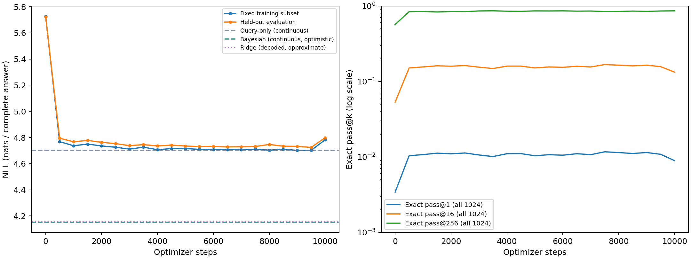
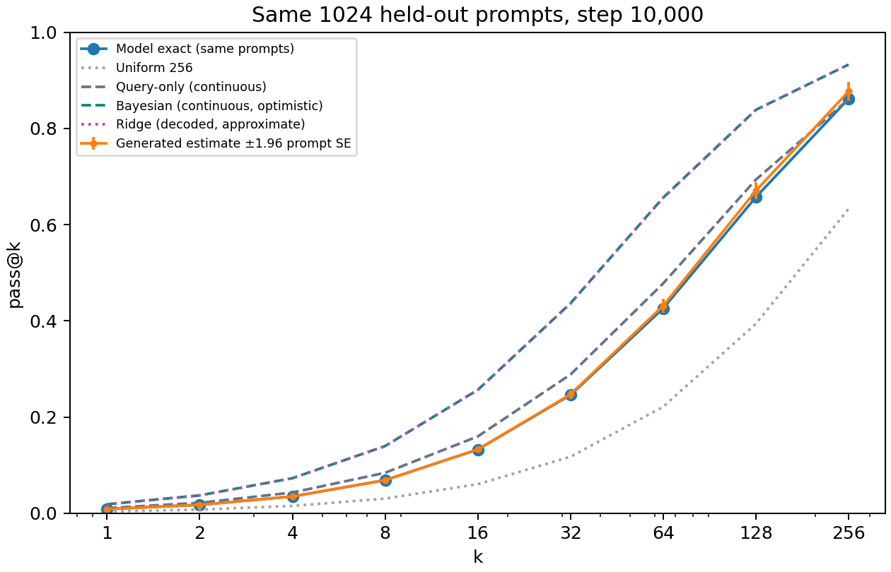

# First fixed-pool SFT run — completed

Definitions of all evaluation metrics, normalization choices, and a detailed
interpretation are in [EVALUATION.md](EVALUATION.md).

The original run completed **10,000 optimizer steps, 640,000 example presentations,
and 6.4 passes** through the fixed training pool in **2,489.97 seconds (41.50 minutes)**.
The scratch Qwen2 model has **988,032 trainable parameters**. Training used GPU 1
(NVIDIA L40), BF16 autocast with FP32 master weights, effective batch 64 and
**16 × 4 accumulation**. Its training implementation was commit `f98f405`.

The launcher was subsequently changed, as requested, to **64 × 1 with online
W&B logging** (`b2aba57`). Those changes did not affect this completed run, which
retains its original configuration and local logs. A second training run has
not been launched. The next launch uses run name
`qwen2_1m_fixed100k_sft_10000_bs64x1` and W&B project `noisy-regression-sft`.

## Learning and reference comparisons

All likelihood values below are nats per complete two-token answer. Every row
uses the same 1,024 held-out examples. The best checkpoint is selected by NLL.

| Predictor | Answer NLL | Exact pass@1 | Exact pass@16 | Exact pass@256 |
|---|---:|---:|---:|---:|
| Untrained model | 5.72250 | 0.3425% | — | — |
| Best checkpoint, step 9,500 | **4.72439** | **1.0846%** | 15.7105% | 85.7338% |
| Final checkpoint, step 10,000 | 4.79860 | 0.8931% | 13.2745% | 86.1581% |
| Uniform 256 | 5.54518 | 0.3906% | 6.070% | 63.284% |
| Query-only, continuous input | 4.70249 | 1.1067% | 15.992% | 86.054% |
| Query-only, decoded input approximation | 4.70281 | 1.1064% | 15.988% | 86.043% |
| Bayesian, continuous data (optimistic) | 4.15266 | 1.8922% | 25.667% | 93.269% |
| Ridge, decoded data (approximate) | 4.15420 | 1.8895% | 25.638% | 93.244% |

The initial improvement largely plateaued near the query-only reference. Even
the selected checkpoint did not beat that reference: the paired NLL difference
was **+0.02190 ± 0.00986 prompt SE**; its gap to the continuous Bayesian reference
was **+0.57173 ± 0.02867 prompt SE**. These are descriptive statistics on the
selection pool, not a new independent test.

At step 9,500, fixed-training-subset NLL was 4.70162; at step 10,000 it was
4.78262, versus held-out NLL 4.79860. The final deterioration affected both
subsets. These curves do not establish frozen-target memorization or an
architectural limit. This was one seed and one fixed optimizer configuration.

Mismatching context observations across tasks while preserving each query and
target increased final NLL from **4.79860 to 4.81817**. This is an observed
context effect, but a much smaller effect than the gap to regression references.
Continuous and decoded references are close; their small difference does not
explain the model's large reference gap. The continuous reference sees more
precision, and the decoded Gaussian posterior remains an approximation.

## Final generation and diagnostics

Final generation used **256 independent completions for each of all 1,024
held-out prompts** (262,144 completions). There were **zero invalid or overlength
completions**, with 2,333 complete digit-pair matches. All predictions used the
same 16-digit conditional distributions as likelihood evaluation.

| k | Exact pass@k | Generated estimator | Generated prompt SE | Conditional sampling SD of mean |
|---|---:|---:|---:|---:|
| 1 | 0.008931 | 0.008900 | 0.000192 | 0.000184 |
| 16 | 0.132745 | 0.132910 | 0.002687 | 0.002539 |
| 256 | 0.861581 | 0.876953 | 0.010270 | 0.009984 |

The estimates agree within sampling variability. The standard errors treat
regression examples as units. The full report includes all nine requested k
values and paired exact-versus-sampled differences.

Final first-token NLL was **2.03625**, second-token conditional NLL **2.76235**,
and predicted entropy **5.01296 nats/answer**. Maximum distribution normalization
error was **2.28e-7**. Exact-distribution predictive-mean MSE was **1.31621** against continuous noisy
outcomes, **1.31107** against decoded target centers, and **1.07572** against the
continuous noiseless signal.

The **mean of 256 sampled predictions** has MSE **1.085008 ± 0.060132 prompt SE**
against the continuous noiseless signal over all 1,024 final evaluation prompts
(approximate 95% interval: **[0.967149, 1.202866]**). Each completion is decoded
to its scalar grid center; the 256 values are averaged within each prompt before
squaring the error against `w·x_query`. This differs from averaging 256 squared
prediction errors. Finite sampling makes this metric differ from the
exact-distribution predictive-mean MSE above.

This metric was added after training in commit `00b136c` and computed for all
21 evaluations using their original saved completions, without new sampling.
Periodic steps use their original 128-prompt generation subset; the final step
uses all 1,024 prompts. JSONL and checkpoint metrics now include
`eval.generation.sampled_mean_mse`; the backfill history and
provenance are recorded in `sampled_mean_mse_backfill.json`. The original metrics
are retained on the server in `metrics_before_sampled_mean_mse/`.

Train clipping counts were 6/6,400,000 context-input scalars,
627/1,600,000 context outcomes, 1/400,000 query-input scalars, and 39/100,000
query outcomes. Evaluation counts were 0/65,536, 9/16,384, 0/4,096, and 1/1,024,
respectively. There were **zero overlapping tokenized prompts** across splits.

## Reproducibility and artifacts

The server run directory is
`~/maxrl/noisy-regression/checkpoints/qwen2_1m_fixed100k_sft_10000/`.
All **21 checkpoints** are retained. Best: `checkpoint-09500`; final:
`checkpoint-10000`. Raw frozen data and full latent variables are in
`~/maxrl/noisy-regression/data/fixed_d4_n16_100k/`.

The local artifact copy is `noisy-regression/outputs/first_run/`: `report.md`,
`metrics.jsonl`, `manifest.json`, `dataset_metadata.json`, `references.json`,
`summary.json`, codec, checkpoint metrics, figures, and `results_bundle.tar.gz`.
Full model/optimizer checkpoints and per-prompt probability/completion NPZ
artifacts remain on the server. The generated report contains all metrics and
the exact checkpoint paths.

Content SHA-256 fingerprints:

- Training: `22b355f84fc060338509cce710000e286ca3e2729bd9cb1ba577a04b9ded1f48`
- Evaluation: `a9b17e7a62571ec7e4f15eaf49c5eb1f51857c3e42ff3661a4fea10523210954`

Seeds were 1729/2718 for train/evaluation data, 3141 for initialization, 1618
for data order, 5772 for fixed subsets, and 8119 + checkpoint step for sampling.
Runtime: Python 3.10.21, PyTorch 2.6.0+cu124, Transformers 4.57.6, NumPy 2.2.6,
SciPy 1.15.3; figures used Matplotlib 3.10.9. Runtime is the observed wall-clock
time on a shared server, not a controlled throughput comparison.

Validation: the original 10 focused CPU checks passed. After the launcher and
W&B changes, two targeted CPU checks passed for same-step W&B history merging,
single-microbatch training, and checkpoint resume. Ruff and shell syntax checks
passed. W&B 0.28.0 is installed and its credential is configured; W&B recording
was tested with a stub SDK run, without uploading the completed experiment.
Three targeted CPU checks passed after the sampled-mean MSE addition, covering
the analytic calculation, saved subset/final metrics, and W&B scalar logging.

There is one held-out evaluation pool, reused for selection, and **no independent
final test split**. Low exact-match probability alone is not evidence that the
inference problem is difficult; the noisy target and fine quantization matter.
